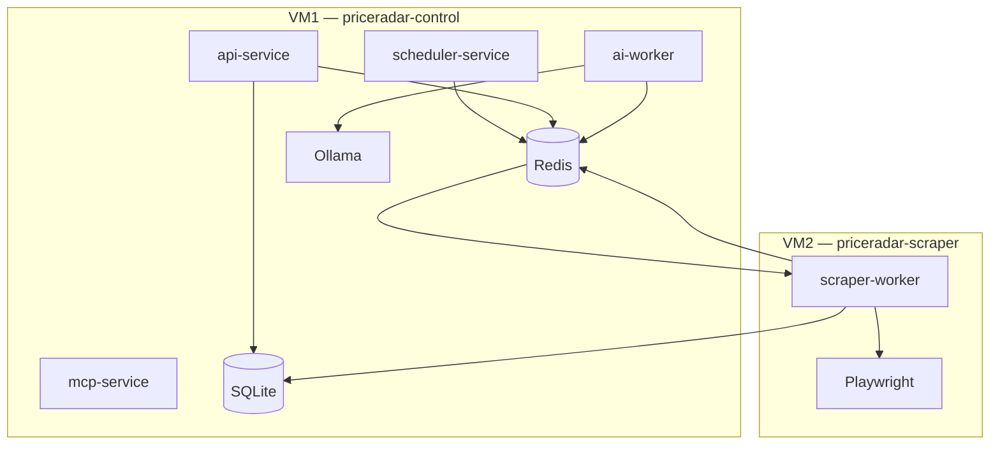

# PriceRadar — Guida implementazione passo-passo

Questa guida descrive **come mettere in piedi e far girare** PriceRadar dall'infrastruttura al primo prodotto tracciato. Segui i passi in ordine: ogni fase dipende dalla precedente.

---

## Architettura target: 2 VM su Proxmox

PriceRadar è pensato per girare su **due VM separate**, non su una sola macchina.

| VM | Nome suggerito | Ruolo | Servizi |
|----|----------------|-------|---------|
| **VM1** | `priceradar-control` | Control plane | API, scheduler, AI worker, MCP, **Redis**, **SQLite**, **Ollama** |
| **VM2** | `priceradar-scraper` | Scraper plane | **scraper-worker** + Playwright/Chromium |



### Perché due VM

- **Isolamento risorse:** Playwright consuma molta RAM/CPU; non deve competere con API e DB.
- **Isolamento rete:** se un IP viene limitato per anti-bot, colpisce solo VM2.
- **Scalabilità:** puoi aggiungere VM2 aggiuntive (stesso Redis, stesso DB condiviso) senza toccare il control plane.
- **Manutenzione:** aggiorni Chromium/scraper senza riavviare API o scheduler.

### Collegamenti tra le VM

| Risorsa | Dove vive | Come la raggiunge VM2 |
|---------|-----------|------------------------|
| Redis | VM1 | `REDIS_URL=redis://<IP-VM1>:6379` |
| SQLite | VM1 (file) | NFS: VM2 monta `/opt/price-radar/data` da VM1 |
| Ollama | VM1 | Solo VM1 la usa (ai-worker locale) |
| Code BullMQ | Redis su VM1 | scraper-worker su VM2 consuma la coda remota |

> **Nota SQLite + NFS:** accettabile per carichi moderati e pochi worker. Se cresci molto, valuta PostgreSQL (evoluzione futura). Con WAL mode e un solo writer concorrente per VM2 va bene per iniziare.

### File env per VM

- VM1 → copia `env.vm1.example` in `.env`
- VM2 → copia `env.vm2.example` in `.env` (aggiorna IP VM1)

---

## Panoramica delle fasi

| Fase | Cosa fai | Dove |
|------|----------|------|
| 1 | Creare le 2 VM su Proxmox | Proxmox |
| 2 | Installare dipendenze di sistema | VM1 + VM2 (diversi) |
| 3 | Configurare il progetto Node.js | Entrambe le VM |
| 4 | NFS + Redis remoto + `.env` | VM1 poi VM2 |
| 5 | Build e verifica | VM1 prima |
| 6 | Avviare i servizi | VM1 (4 proc) + VM2 (1 proc) |
| 7 | Verificare end-to-end | Da VM1 o client esterno |
| 8 | Primo prodotto tracciato | API su VM1 |
| 9 | Monitoraggio | Entrambe |
| 10 | systemd produzione | Entrambe |
| 11 | Estensioni (scraper, MCP) | Repo condiviso |

---

## Fase 1 — Creare le 2 VM su Proxmox

### 1.1 VM1 — Control plane (`priceradar-control`)

| Risorsa | Valore consigliato |
|---------|-------------------|
| OS | Ubuntu Server 24.04 LTS |
| CPU | 2 core |
| RAM | 4 GB |
| Disco | 40 GB SSD |
| IP | statico es. `192.168.1.10` |

Servizi che gireranno qui: API, scheduler, AI worker, MCP, Redis, SQLite, Ollama.

### 1.2 VM2 — Scraper plane (`priceradar-scraper`)

| Risorsa | Valore consigliato |
|---------|-------------------|
| OS | Ubuntu Server 24.04 LTS |
| CPU | 4 core |
| RAM | 8 GB (Playwright è affamato) |
| Disco | 30 GB SSD |
| IP | statico es. `192.168.1.11` |

Servizi che gireranno qui: **solo** `scraper-worker` + Chromium.

### 1.3 Setup base su entrambe

Su **VM1 e VM2**, esegui:

```bash
sudo apt update && sudo apt upgrade -y
sudo apt install -y curl git build-essential

sudo adduser priceradar
sudo usermod -aG sudo priceradar
su - priceradar
```

### 1.4 Verifica connettività tra VM

Da VM2:

```bash
ping -c 3 192.168.1.10        # IP di VM1
curl -I https://www.amazon.it   # egress verso ecommerce
```

Da VM1:

```bash
ping -c 3 192.168.1.11        # IP di VM2
```

---

## Fase 2 — Installare le dipendenze di sistema

Le dipendenze **non sono le stesse** sulle due VM.

### 2.1 Su entrambe le VM — Node.js e pnpm

```bash
curl -fsSL https://deb.nodesource.com/setup_20.x | sudo -E bash -
sudo apt-get install -y nodejs
corepack enable
corepack prepare pnpm@latest --activate
node -v && pnpm -v
```

### 2.2 Solo VM1 — Redis

```bash
sudo apt-get install -y redis-server
```

Modifica Redis per accettare connessioni da VM2:

```bash
sudo sed -i 's/^supervised no/supervised systemd/' /etc/redis/redis.conf
echo "bind 0.0.0.0" | sudo tee -a /etc/redis/redis.conf
# Opzionale: requirepass your-redis-password
sudo systemctl enable redis-server
sudo systemctl restart redis-server
redis-cli ping   # PONG
```

Firewall (solo rete interna):

```bash
sudo ufw allow from 192.168.1.11 to any port 6379
```

Da **VM2**, verifica:

```bash
redis-cli -h 192.168.1.10 ping   # deve rispondere PONG
```

### 2.3 Solo VM1 — Ollama

```bash
curl -fsSL https://ollama.com/install.sh | sh
ollama pull llama3.2
curl http://127.0.0.1:11434/api/tags
```

### 2.4 Solo VM2 — Playwright / Chromium

```bash
cd /opt/price-radar
pnpm exec playwright install chromium
sudo npx playwright install-deps chromium
```

> VM1 **non** ha bisogno di Playwright.

---

## Fase 3 — Configurare il progetto Node.js

Deploy del **lo stesso repository** su entrambe le VM (`/opt/price-radar`).

### 3.1 Su VM1 e VM2

```bash
cd /opt
sudo mkdir -p price-radar
sudo chown $USER:$USER price-radar
git clone <url-repo> price-radar
cd price-radar
pnpm install
pnpm build
```

Su **VM2** aggiungi anche Playwright (Fase 2.4).

---

## Fase 4 — NFS, Redis remoto e variabili d'ambiente

### 4.1 VM1 — Esportare la directory dati via NFS

```bash
sudo apt install -y nfs-kernel-server
sudo mkdir -p /opt/price-radar/data
sudo chown -R priceradar:priceradar /opt/price-radar/data
```

Aggiungi a `/etc/exports`:

```
/opt/price-radar/data 192.168.1.11(rw,sync,no_subtree_check,no_root_squash)
```

```bash
sudo exportfs -ra
sudo systemctl enable nfs-kernel-server
sudo systemctl restart nfs-kernel-server
```

### 4.2 VM2 — Montare la directory dati da VM1

```bash
sudo apt install -y nfs-common
sudo mkdir -p /opt/price-radar/data
```

Aggiungi a `/etc/fstab`:

```
192.168.1.10:/opt/price-radar/data  /opt/price-radar/data  nfs  defaults  0  0
```

```bash
sudo mount -a
ls /opt/price-radar/data   # deve essere scrivibile
```

### 4.3 File `.env` per VM

**VM1:**

```bash
cp env.vm1.example .env
mkdir -p data/{screenshots,html-failures,logs}
```

**VM2:**

```bash
cp env.vm2.example .env
# Modifica REDIS_URL con IP reale di VM1
```

### 4.4 Riepilogo servizi per VM

| Servizio | VM1 | VM2 |
|----------|-----|-----|
| api-service | ✅ | ❌ |
| scheduler-service | ✅ | ❌ |
| ai-worker | ✅ | ❌ |
| mcp-service | ✅ | ❌ |
| scraper-worker | ❌ | ✅ |
| Redis | ✅ | ❌ (client remoto) |
| SQLite (file) | ✅ master | ✅ via NFS |
| Ollama | ✅ | ❌ |
| Playwright | ❌ | ✅ |

---

## Fase 5 — Build e verifica iniziale

### 5.1 Installare il browser Playwright

```bash
pnpm exec playwright install chromium
```

### 5.2 Test rapido API (senza altri servizi)

```bash
pnpm dev:api
```

In un altro terminale:

```bash
curl http://localhost:3000/health
```

Risposta attesa:

```json
{
  "status": "ok",
  "services": { "database": true, "redis": true }
}
```

Se `redis: false` → torna alla Fase 2.3.
Se `database: false` → controlla permessi su `./data`.

Ferma l'API con `Ctrl+C`.

---

## Fase 6 — Avviare i servizi

### 6.1 VM1 — Control plane (4 processi)

```bash
cd /opt/price-radar

pnpm dev:api          # terminale 1 — porta 3000
pnpm dev:scheduler    # terminale 2
pnpm dev:ai           # terminale 3
pnpm dev:mcp          # terminale 4 — opzionale, stdio per Cursor
```

In produzione (dopo `pnpm build`):

```bash
node apps/api-service/dist/index.js &
node apps/scheduler-service/dist/index.js &
node apps/ai-worker/dist/index.js &
```

### 6.2 VM2 — Scraper plane (1 processo)

```bash
cd /opt/price-radar
pnpm dev:scraper
```

In produzione:

```bash
node apps/scraper-worker/dist/index.js
```

### 6.3 Dev locale (tutto su una macchina)

Per sviluppo puoi usare **una sola macchina** con `cp env.example .env` e `pnpm dev`. La topologia a 2 VM è per **produzione su Proxmox**.

---

## Fase 7 — Verificare che tutto funzioni

### 7.1 Health check

```bash
curl http://localhost:3000/health
curl http://localhost:3000/health/ready
```

### 7.2 Retailer disponibili

```bash
curl http://localhost:3000/api/retailers
```

Deve restituire `amazon`, `unieuro`, `mediaworld` (seed automatico al primo avvio).

### 7.3 Redis — code BullMQ

```bash
redis-cli KEYS "bull:*"
```

Dopo l'avvio dello scheduler, possono comparire chiavi `bull:scrape-jobs:*`.

### 7.4 Log strutturati

Ogni servizio scrive JSON su stdout. Cerca messaggi come:

```json
{"level":"info","message":"Scraper worker started","service":"scraper-worker"}
{"level":"info","message":"Scheduler started","service":"scheduler-service"}
```

### 7.5 Database SQLite

```bash
pnpm db:studio
```

Apre Drizzle Studio nel browser per ispezionare tabelle e dati.

---

## Fase 8 — Aggiungere il primo prodotto

### 8.1 Creare un prodotto via API

```bash
curl -X POST http://localhost:3000/api/products \
  -H 'Content-Type: application/json' \
  -d '{
    "title": "Apple iPhone 15 128GB",
    "url": "https://www.amazon.it/dp/B0CHX1WGLX",
    "retailerSlug": "amazon",
    "externalId": "B0CHX1WGLX"
  }'
```

Cosa succede internamente:

```
POST /api/products
  → inserisce riga in `products`
  → crea `scrape_jobs` con status "queued"
  → accoda job su Redis (BullMQ queue "scrape-jobs")
  → scraper-worker preleva il job
  → Playwright apre browser dedicato
  → extract → normalize → validate
  → salva prezzo in `product_prices`
  → aggiorna `scrape_jobs` a "completed"
```

### 8.2 Verificare il job

```bash
curl http://localhost:3000/api/jobs
```

Cerca un job con `"status": "completed"`.

### 8.3 Leggere l'ultimo prezzo

```bash
curl http://localhost:3000/api/products/<PRODUCT_ID>/price
```

Sostituisci `<PRODUCT_ID>` con l'`id` restituito dal POST.

### 8.4 Storico prezzi

```bash
curl http://localhost:3000/api/products/<PRODUCT_ID>
```

---

## Fase 9 — Monitorare job e prezzi

### 9.1 Flusso dati continuo

```
scheduler (ogni 60s)
  → trova job pending/failed scaduti
  → li accoda su Redis
  → crea nuovi job per prodotti senza job attivi

scraper-worker
  → esegue scraping
  → se variazione prezzo >= 40% → accoda job AI + salva anomaly

ai-worker
  → analizza anomalia con Ollama (o euristica)
  → aggiorna `price_anomalies.ai_analysis`
```

### 9.2 Dove guardare in caso di errori

| Problema | Dove controllare |
|----------|------------------|
| Job bloccato in `running` | Log scraper-worker, riavvia worker |
| Job `failed` | `GET /api/jobs`, campo `error` |
| Anti-bot | Log con `"isAntiBot": true`, screenshot in `data/screenshots/` |
| HTML pagina errore | `data/html-failures/` |
| Failure persistiti | `data/logs/scrape-failures.jsonl` |
| Anomalie prezzo | tabella `price_anomalies` via `pnpm db:studio` |

### 9.3 Retry automatici

BullMQ riprova fino a `SCRAPE_MAX_ATTEMPTS` (default 3) con backoff esponenziale (5s, 25s, …). Non serve intervento manuale per errori transitori.

---

## Fase 10 — Produzione con systemd

### 10.1 VM1 — Unit control plane

Crea su **VM1**:

- `price-radar-api.service`
- `price-radar-scheduler.service`
- `price-radar-ai.service`

(Esempi identici a prima, con `EnvironmentFile=/opt/price-radar/.env`)

```bash
sudo systemctl enable price-radar-api price-radar-scheduler price-radar-ai
sudo systemctl start price-radar-api price-radar-scheduler price-radar-ai
```

### 10.2 VM2 — Unit scraper

Crea su **VM2** solo:

- `price-radar-scraper.service`

```ini
[Unit]
Description=PriceRadar Scraper Worker
After=network.target remote-fs.target
Requires=remote-fs.target

[Service]
Type=simple
User=priceradar
WorkingDirectory=/opt/price-radar
EnvironmentFile=/opt/price-radar/.env
ExecStart=/usr/bin/node apps/scraper-worker/dist/index.js
Restart=always
RestartSec=10

[Install]
WantedBy=multi-user.target
```

`Requires=remote-fs.target` assicura che NFS sia montato prima dello scraper.

```bash
sudo systemctl enable price-radar-scraper
sudo systemctl start price-radar-scraper
```

### 10.3 Backup database (solo VM1)

```bash
0 3 * * * cp /opt/price-radar/data/price-radar.db /backup/price-radar-$(date +\%Y\%m\%d).db
```

### 10.4 Scalare scraper (opzionale)

Puoi clonare **VM2** (stesso `.env`, stesso mount NFS, stesso `REDIS_URL`). BullMQ distribuisce i job tra più worker automaticamente. Aumenta `SCRAPE_CONCURRENCY` con cautela (RAM).

---

## Fase 11 — Estendere il sistema

### 11.1 Aggiungere un nuovo scraper (es. `euronics`)

**Passo 1** — Crea la cartella:

```
packages/scraper-core/src/scrapers/euronics/index.ts
```

**Passo 2** — Implementa le 4 funzioni:

```typescript
export const euronicsScraper: PlaywrightScraperPlugin = {
  slug: 'euronics',
  name: 'Euronics',
  baseUrl: 'https://www.euronics.it',
  async search(params, ctx, page) { /* ... */ },
  async extract(params, ctx, page) { /* ... */ },
  normalize(raw) { /* ... */ },
  validate(product) { /* ... */ },
};
```

**Passo 3** — Registra in `packages/scraper-core/src/index.ts`:

```typescript
import { euronicsScraper } from './scrapers/euronics/index.js';
// ...
registry.register(euronicsScraper);
```

**Passo 4** — Aggiungi il retailer nel seed DB (`packages/db/src/client.ts`):

```typescript
{ slug: 'euronics', name: 'Euronics', baseUrl: 'https://www.euronics.it' },
```

**Passo 5** — Rebuild e riavvio:

```bash
pnpm build
sudo systemctl restart price-radar-scraper
```

### 11.2 Integrare MCP con Cursor

Crea o modifica `.cursor/mcp.json` nel tuo progetto Cursor:

```json
{
  "mcpServers": {
    "price-radar": {
      "command": "pnpm",
      "args": ["--filter", "@price-radar/mcp-service", "dev"],
      "cwd": "/opt/price-radar"
    }
  }
}
```

Tools disponibili:

| Tool | Uso |
|------|-----|
| `getProductPrice` | Legge ultimo prezzo da DB |
| `matchProducts` | Confronta prodotti simili |
| `detectAnomaly` | Valuta se un prezzo è anomalo |
| `repairSelector` | Suggerisce selettore CSS alternativo |

### 11.3 Modificare soglia anomalie

La soglia attuale è **40%** di variazione (hardcoded in `apps/scraper-worker/src/processor.ts`). Per cambiarla, modifica il valore e rebuilda.

### 11.4 Aumentare frequenza scraping

In `.env`:

```env
SCHEDULER_INTERVAL_MS=300000   # ogni 5 minuti invece di 60s
```

---

## Troubleshooting

### Redis non raggiungibile

```bash
sudo systemctl status redis-server
redis-cli ping
```

Verifica `REDIS_URL` in `.env`.

### Playwright: browser non trovato

```bash
pnpm exec playwright install chromium
sudo npx playwright install-deps chromium
```

### Ollama non risponde

```bash
sudo systemctl status ollama
curl http://localhost:11434/api/tags
```

Il sistema continua a funzionare con euristiche locali.

### Job sempre in `failed`

1. Controlla `data/screenshots/` e `data/html-failures/`
2. Il sito potrebbe aver bloccato lo scraping (anti-bot)
3. I selettori CSS potrebbero essere obsoleti → usa `repairSelector` via MCP o aggiorna lo scraper

### Memoria insufficiente

Riduci in `.env`:

```env
SCRAPE_CONCURRENCY=1
AI_CONCURRENCY=1
```

Ogni job Playwright usa ~200-400 MB RAM.

### Permessi su `data/`

```bash
sudo chown -R priceradar:priceradar /opt/price-radar/data
chmod -R 755 /opt/price-radar/data
```

---

## Checklist finale

Prima di considerare il deploy completo, verifica:

- [ ] `curl /health` → `"status": "ok"`
- [ ] Redis risponde `PONG`
- [ ] Ollama risponde (o accetti fallback euristico)
- [ ] POST prodotto → job `completed`
- [ ] Prezzo salvato in `product_prices`
- [ ] Scheduler accoda job periodicamente
- [ ] Log JSON visibili su stdout/journalctl
- [ ] Backup DB configurato
- [ ] systemd units attive e `Restart=always`

---

## Riferimenti rapidi

| Risorsa | Percorso |
|---------|----------|
| README tecnico | `/README.md` |
| Variabili ambiente | `/env.example` |
| Schema DB | `/packages/db/src/schema.ts` |
| Plugin scraper | `/packages/scraper-core/src/scrapers/` |
| Code BullMQ | `/packages/shared/src/queues.ts` |
| Client Ollama | `/packages/ai-core/src/ollama.ts` |
| MCP tools | `/apps/mcp-service/src/server.ts` |
